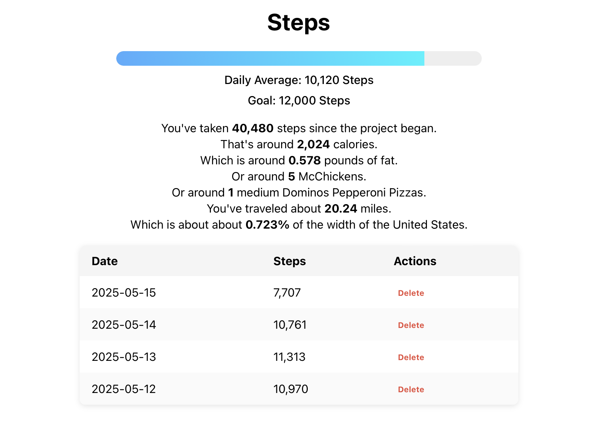

# Steps

This is a simple site to help motivate getting your steps in. 

## How to run

From the steps-ui folder run `npm start`

From the Steps.Api folder run `dotnet run -- "Data Source=<path to db>"`, where `<path to db>` is wherever 
you'd like the database to live

